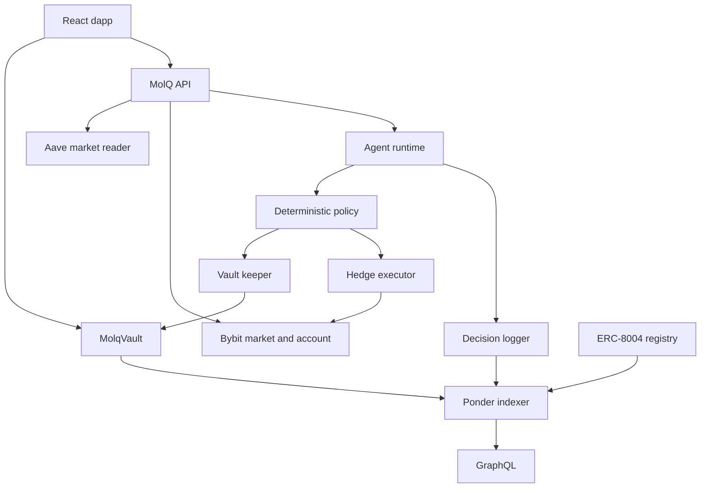

## Repository layout

| Path              | Responsibility                                                       |
| ----------------- | -------------------------------------------------------------------- |
| `apps/landing`    | Public protocol website and live market summary.                     |
| `apps/web`        | Wallet, deposit, withdrawal, performance, and agent UI.              |
| `apps/api`        | Market reads, policy runtime, keeper, executor, and operator routes. |
| `apps/indexer`    | Ponder event indexing and GraphQL.                                   |
| `apps/docs`       | Mintlify product and developer documentation.                        |
| `contracts`       | Foundry contracts, scripts, and tests.                               |
| `packages/shared` | Mantle addresses and shared TypeScript contracts.                    |

## Trust boundaries

1. The model returns a proposal; it cannot directly call contracts or exchanges.
2. Policy code constrains actions and target notional.
3. Vault writes require the authorized onchain keeper.
4. Exchange writes require explicit trading enablement and venue checks.
5. Operator endpoints require `X-Molq-Operator-Key`.
6. Decision evidence is committed to the logger and indexed independently.
