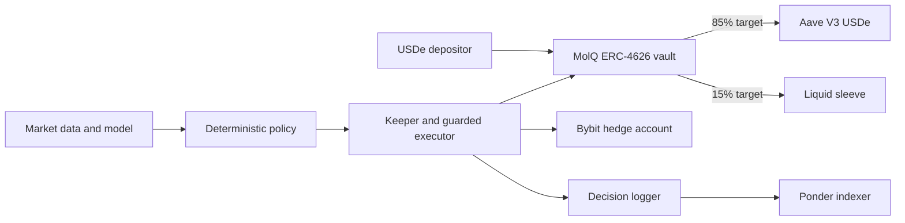

## Capital flow

### Shield sleeve

The shield sleeve holds Aave V3 aUSDe. Deposits automatically supply the target
portion to Aave, and `totalAssets()` counts both idle USDe and aUSDe.

### Liquid and hedge sleeve

The vault keeps a liquid target for withdrawals and strategy operations. A
separately funded Bybit account can hold a policy-capped ETHUSDT short. Exchange
collateral is not transferred from the vault by the smart contract.

### Profit hardening

External strategy profit only becomes vault profit when the keeper returns USDe
and calls `hardenProfit`. The contract transfers the configured performance fee
to treasury, keeps the net profit for shareholders, and rebalances the vault.

## Business model

MolQ charges:

- No deposit fee.
- No withdrawal fee.
- No fee on unrealized PnL.
- A 10% fee on realized external profit hardened into the vault.

The contract caps the performance fee at 20%.

<Info>
	Aave interest increases the vault's aUSDe balance and therefore the value of `mqUSDe`. The
	separate performance fee path applies to external alpha profit.
</Info>
