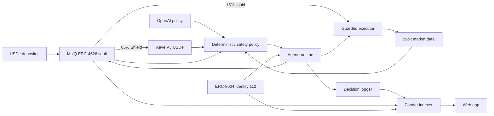

# Architecture

## Trust Boundaries

1. The model can propose an action but cannot call a contract or exchange.
2. The policy caps risk score, market freshness, funding carry, drift, and hedge
   notional.
3. Vault writes require the on-chain keeper.
4. Bybit writes require explicit trading arming and pass leverage, slippage,
   notional, minimum-order, and idempotency checks.
5. Operator API routes require a timing-safe API-key comparison.
6. Every accepted policy outcome can be hashed with execution evidence and
   written to the verified decision logger.

## Capital Flow

- Deposits mint `mqUSDe`; no deposit or withdrawal fee is charged.
- The vault supplies its target Shield allocation directly to Aave V3.
- The liquid sleeve remains in the vault until an explicitly armed off-chain
  execution workflow uses separately controlled venue capital.
- Realized Alpha profit returns as USDe through `hardenProfit`.
- The vault transfers 10% of gross realized profit to treasury and allocates the
  remaining 90% to shareholders.

The exchange account is not trustless custody. This limitation is explicit:
mainnet scale requires a qualified custody/settlement design and reconciliation
proofs between on-chain liquid allocation and venue collateral.
